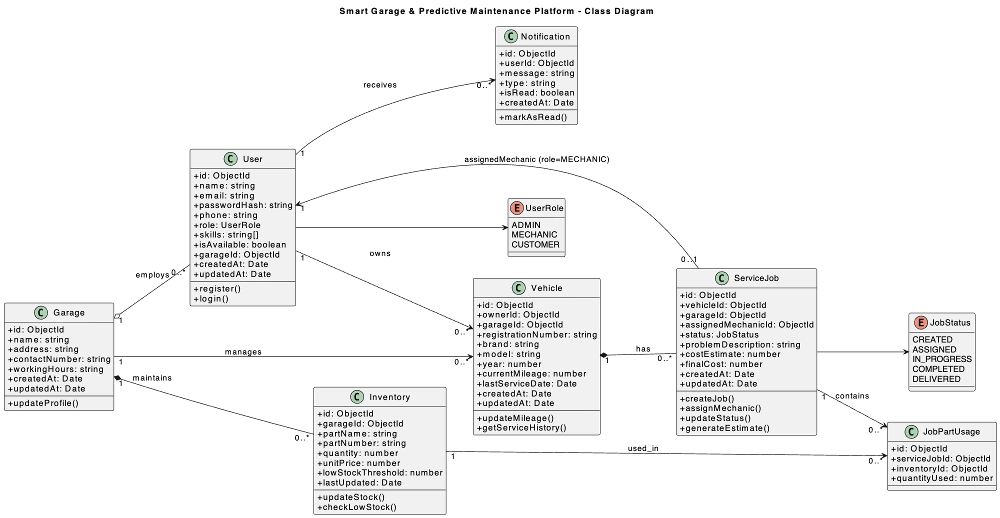

# Class Diagram

This diagram shows the system's object-oriented design, including classes, relationships, and responsibilities following SOLID principles.

[View Full Class Diagram (PDF)](./docs/Class_Diagram.pdf)